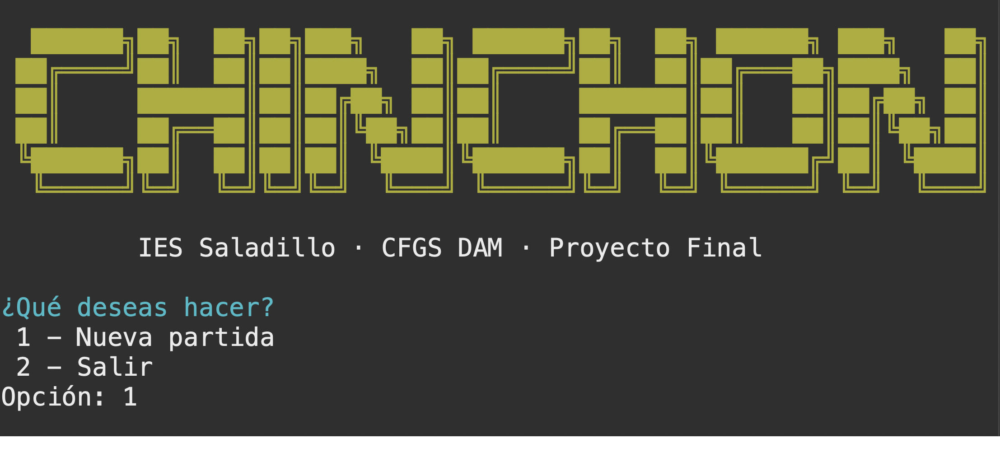
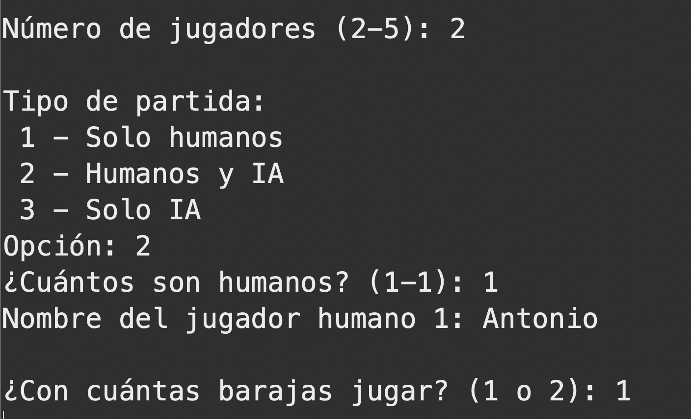
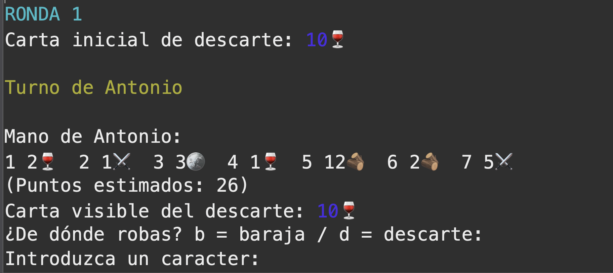
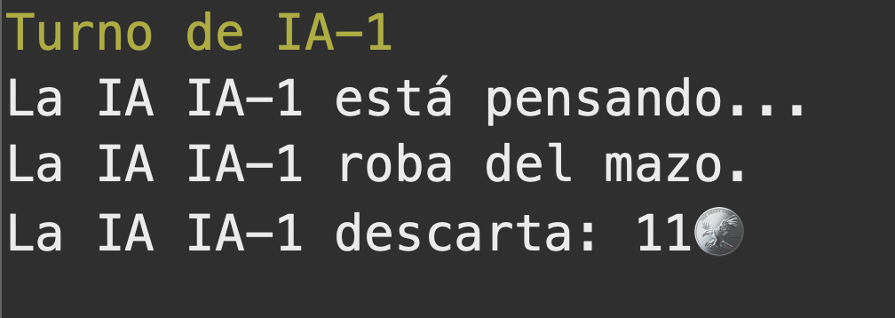
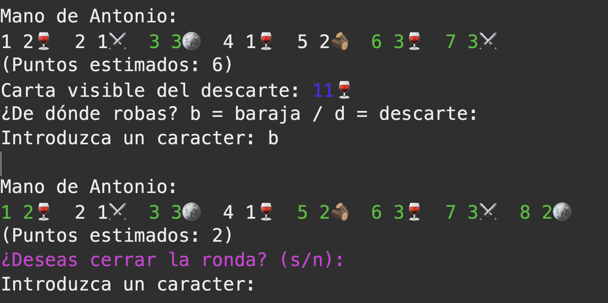
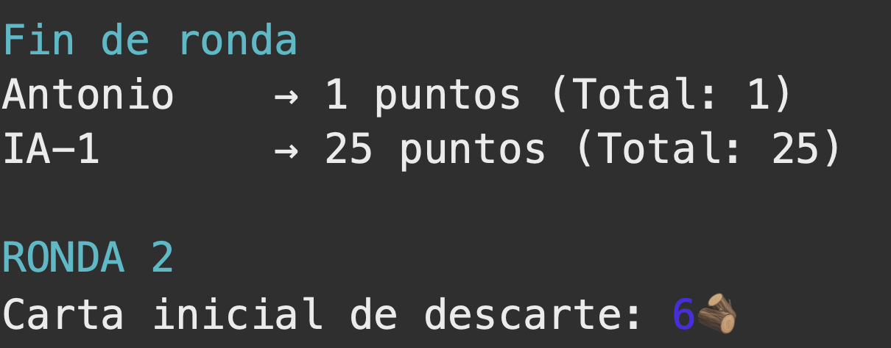
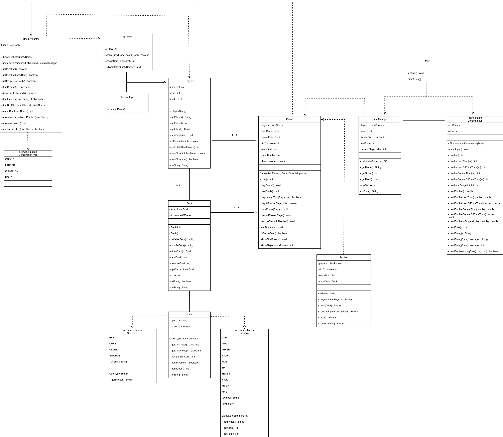
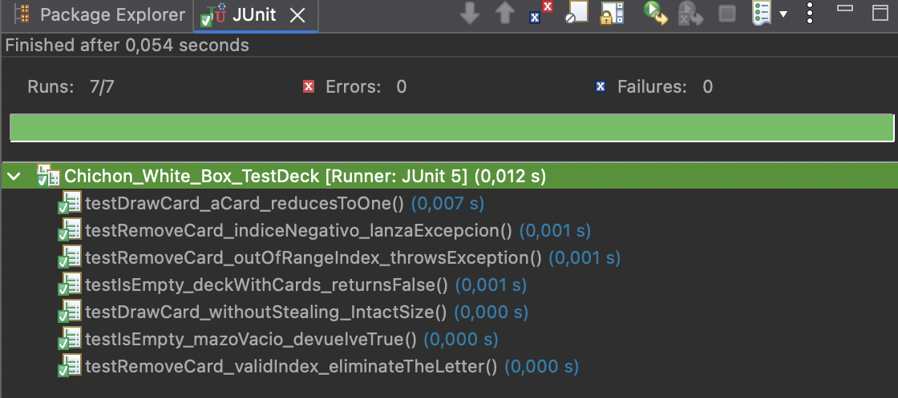
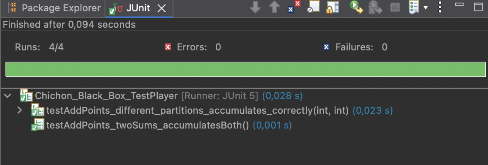
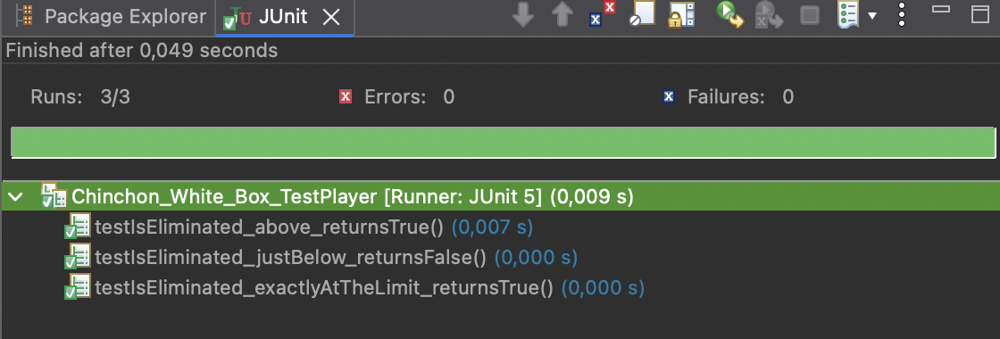

# Chinchón Java Project 🃏

>Este proyecto es una implementación  del  juego de cartas **Chinchón**, desarrollado íntegramente en Java.

---
## ¿Qué es el Chinchon?
El **Chinchón** es un juego clásico de la baraja española, donde los jugadores intentan formar combinaciones para cerrar las rondas con el menor número de puntos posibles y ganar la partida.

El **objetivo principal** es organizar una mano de 7 cartas en combinaciones válidas (escaleras o grupos) para minimizar la puntuación de penalización total. La partida termina cuando un jugador logra la combinación máxima (*Chinchón*) o cuando todos los rivales superan el límite de puntos establecido en la configuración (por defecto, `100 puntos`).

---

## Funcionamiento y Reglas del Juego 

- **Simulación:** Soporta de 2 a 5 jugadores en 3 modalidades diferentes: 
    - Humano vs Humano 
    - Humano vs IA 
    - IA vs IA.

- **Inteligencia Artificial:** Los jugadores controlados por el sistema, simulan diferentes lógicas, evaluando el descarte frente al mazo principal. 

- **Interfaz:** Utilizaremos los códigos de escape **ANSI** para facilitar la identificación visual de cartas combinadas (Verde) y descartadas (Rojo).

- **Control de estado de Mazos:** Tiene un sistema que almacena la cartas  descartadas cuando la baraja principal se agota. 

-  **Reparto:** Se distribuyen 7 cartas a cada participante. La siguiente carta se coloca bocarriba, iniciando la pila de descarte.

- **Turnos**: En cada turno, el jugador tendrá dos opciones, o coge la carta de descartes, o de la baraja, luego deberá de eliminar una de las cartas de su mano para quedarse con 7 cartas.

- **Dinámica del Turno**
    - **Fase de Robo:** El jugador activo analiza la carta visible del descarte. Puede optar por robarla (si beneficia su estrategia) o tomar la carta oculta de la baraja principal.

    - **Fase de Descarte:** Tras el robo, el jugador posee 8 cartas. Debe seleccionar obligatoriamente una carta para mandarla a la pila de descarte (ordenas númericamente), regresando su mano a 7 cartas.

- **Combinaciones**: Para poder hacer combinaciones se necesitarán almenos 3 cartas.
  - **Escaleras**: Cartas consecutivas del mismo palo
  - **Grupos**: Cartas del mismo número

- **Condiciones de Cierre:** Un jugador solo puede hacer el cierre de la ronda si se cumplen los siguientes criterios de la lógica del juego:
   - No es el primer turno de la ronda.
   - Posee al menos 6 cartas combinadas.
   - En caso de combinar 6 cartas, la carta restante, debe de tener un valor igual o inferior a ***5***.
   - Si el jugador consigue combinar las 7 cartas, el cierre es automático y se le descontarán **10 puntos** al total de puntos acumalados de ese jugador.
   - Si las 7 cartas forman una escalera del mismo palo, se declara **Chinchón**, ganando la partida instantáneamente.

---

### Explicación de la Jugabilidad (Paso a Paso)
El flujo del juego se procesa de forma lineal, guiando al usuario mediante menús numéricos validados:
- **Paso 1:** El sistema muestra la ronda actual y la carta del descarte.
- **Paso 2:** Se genera de forma exclusiva la mano del jugador, destacando en color verde las cartas que el evaluador ya detecta como combinadas.
- **Paso 3:** Se solicita la acción de robo (`b` para baraja, `d` para descarte).
- **Paso 4:** Si el jugador cumple los requisitos de cierre, se le pregunta si desea finalizar la ronda (`s` para terminar la ronda, `n` para **no** terminar la ronda). En caso negativo, o de no cumplir requisitos, se pasa a la selección de descarte (del 1 al 8 para descartar).

### Capturas de Pantalla de la Jugabilidad
>A continuación se presentan las evidencias de la ejecución del programa en la consola

#### Menú Principal y Bienvenida


#### Configuraciones de la partida   


#### Interfaz de Turno Humano

   
#### Interfaz de Turno IA 


#### Fase de Finalización de Ronda (Visualización de Combinaciones en Verde)


#### Calculo de Puntos 


---

## Análisis del Proyecto y Organización (cambiar nombre)

### Estructura del Proyecto
El proyecto se organiza en paquetes siguiendo el principio de responsabilidad única:

- **[`src/`](src/)**: Contiene los paquetes de código fuente de la aplicación.
  - **`chinchon.app`**: Clases de control de interfaz e inicio del programa.
  - **`chinchon.dominio`**: El modelo del dominio con las reglas del juego de cartas.
  - **`chinchon.util`**: Clases de soporte cosmético y constantes de la interfaz de consola. (cambiar)
- **[`test/`](test/)**: **Carpeta** que contiene las clases de pruebas unitarias (JUnit) del código.
- **[`assets/`](assets/)**: Carpeta exclusivamente para capturas de pantalla,de evidencias.


> A continuación se detalla la función (explicada de forma breve) de cada clase del sistema junto con el enlace directo a su código fuente en el repositorio:

### Paquete: `chinchon.app`
- **[`Main.java`](src/chinchon/app/Main.java)**: Punto de entrada de la aplicación. 

- **[`GameManager.java`](src/chinchon/app/GameManager.java)**: Gestiona el  menú principal, y la configuración de las partidas.

- **[`ConsoleInput.java`](src/chinchon/app/ConsoleInput.java)**: Gestiona la entrada del usuario desde el teclado.

### Paquete: `chinchon.dominio`
- **[`Player.java`](src/chinchon/dominio/Player.java)**:  Clase base para los jugadores.

- **[`HumanPlayer.java`](src/chinchon/dominio/HumanPlayer.java)**: Jugador humano cuya toma de decisiones se realiza mediante preguntas desde la consola.

- **[`AiPlayer.java`](src/chinchon/dominio/AiPlayer.java)**: Jugador controlado por inteligencia artificial cuya toma de decisiones es automática durante la partida.

- **[`Card.java`](src/chinchon/dominio/Card.java)**: Clase que representa una carta (Palo + Valor).

- **[`CardType.java`](src/chinchon/dominio/CardType.java)**: Enumeración que define los cuatro palos de la baraja.

- **[`CardValue.java`](src/chinchon/dominio/CardValue.java)**: Enumeración con los valores de la baraja. 

- **[`Deck.java`](src/chinchon/dominio/Deck.java)**: Gestiona la baraja de cartas y sus operaciones.

- **[`HandEvaluator.java`](src/chinchon/dominio/HandEvaluator.java)**:  Identifica las combinaciones y calcula los puntos.

- **[`Game.java`](src/chinchon/dominio/Game.java)**: Controla el ciclo de vida de la partida, turnos y rondas.

- **[`CombinationType.java`](src/chinchon/dominio/CombinationType.java)**: Enumeración de las jugadas válidas del juego.

### Paquete: `chinchon.util`
- **[`Colors.java`](src/chinchon/util/Colors.java)**: Clase que contiene algunos códigos **ANSI** para colorear la salida por la consola.

### Carpeta Externa: `test/` (Pruebas Unitarias JUnit)

- **[`Chinchon_Black_Box_TestCard.java`](test/Chinchon_Black_Box_TestCard.java)**: Conjunto de pruebas de **Caja Negra** para el componente `Card`. 
- **[`Chinchon_White_Box_TestCard.java`](test/Chinchon_White_Box_TestCard.java)**: Conjunto de pruebas de **Caja Blanca** para el componente `Card`. 
- **[`Chinchon_Black_Box_TestDeck.java`](test/Chinchon_Black_Box_TestDeck.java)**: Conjunto de pruebas de **Caja Negra** para el componente `Deck`. 
- **[`Chinchon_White_Box_TestDeck.java`](test/Chinchon_White_Box_TestDeck.java)**: Conjunto de pruebas de **Caja Blanca** para el componente `Deck`. 
- **[`Chinchon_Black_Box_TestPlayer.java`](test/Chinchon_Black_Box_TestPlayer.java)**: Conjunto de pruebas de **Caja Negra** para la jerarquía `Player`. 
- **[`Chinchon_White_Box_TestPlayer.java`](test/Chinchon_White_Box_TestPlayer.java)**: Conjunto de pruebas de **Caja Blanca** para la jerarquía `Player`. 

---

## Relaciones entre Clases (UML)


### Herencia (Generalización)
- `HumanPlayer` y `AiPlayer` heredan de `Player`, compartiendo la gestión de mano y puntos, pero sobrescribiendo la lógica de decisión.

### Enumeraciones
- `Card` utiliza `CardType` y `CardValue` para definir su estado.
- `HandEvaluator` utiliza `CombinationType` para clasificar las jugadas.

### Composiciones
- `Deck` se compone de `Card` El mazo gestiona el ciclo de vida  de las cartas, la existencia de las cartas está en la estructura del mazo.

### Agregaciones (Relación Débil/Contenedor)
- `Deck` agrega objetos `Card`. Las cartas pueden existir fuera de un mazo específico.
- `Game` agrega objetos `Player`. Los jugadores existen antes y después de una partida concreta.

### Dependencias (Uso puntual)
- `Main` depende de `GameManager` para iniciar el sistema.
- `Game` depende de `ConsoleInput` para la interacción.
- `GameManager` depende de `Game` El gestor instancia y lanza la partida tras la configuración.
- `Game.Builder` depende de `Game` Patrón creacional donde el Builder produce instancias configuradas de la clase principal.
- `Player` depende de `HandEvaluator` Los jugadores dependen del evaluador para calcular su estado estratégico en cada turno.
- `AiPlayer` depende de `HandEvaluator` El jugador automático utiliza el evaluador para simular jugadas, comparar puntuaciones antes/después de robar y elegir el descarte óptimo.

---

## Patrones de Diseño Utilizados
### 1. Patrón Singleton (Instancia Única)
 Se aplica en la clase [`ConsoleInput.java`](src/chinchon/app/ConsoleInput.java).

**Código:**
```
private static ConsoleInput instance;

public static ConsoleInput getInstance() {
    if (instance == null) {
        instance = new ConsoleInput(new Scanner(System.in));
    }
    return instance;
}
```
### Por qué y Cómo Funciona:
 La lectura de datos por consola requiere encapsular la escritura del usuario en un Scanner. Si múltiples componentes del programa instanciaran sus propios Scanner, se producirían colisiones en la memoria del buffer y excepciones de flujo cerrado. 
 
 Con este patrón (Singleton) se restringe el constructor a private y expone un método estático global, garantizando la existencia de una sola instancia en toda la vida del programa.

> Es decir, se utiliza para evitar múltiples instancias del `Scanner` y conflictos de buffer.

### 2. Patrón Builder
Se aplica en la clase [`Game.java`](src/chinchon/app/Game.java).

**Código:**
```
/**
 * Clase interna para la construcción fluida de instancias de {@linkGame}.
 */
	public static class Builder {
		private List<Player> players;
		private Deck mainDeck;
		private ConsoleInput ci;
		private int scoreLimit = 100;

		public Builder players(List<Player> players) {
			this.players = players;
			return this;
		}

		public Builder deck(Deck deck) {
			this.mainDeck = deck;
			return this;
		}

		public Builder consoleInput(ConsoleInput ci) {
			this.ci = ci;
			return this;
		}

		public Builder scoreLimit(int scoreLimit) {
			this.scoreLimit = scoreLimit;
			return this;
		}

		public Game build() {
			return new Game(players, mainDeck, ci, scoreLimit);
		}
	}
```
### Por qué y Cómo Funciona:
 La inicialización de una partida de Chinchón requiere parametrizar múltiples dependencias. 
 
El patrón Builder separa la lógica de construcción de la representación del objeto, permitiendo una construcción flexible y legible de las partidas (especialmente útil al configurar distintos límites de puntos o números de jugadores).

---

## Pruebas Unitarias (JUnit)
#### ENFOQUE UTILIZADO

 Cada sección combina dos enfoques:
 
 - **Caja Negra**: Se diseñan los casos a partir del comportamiento esperado
   (qué debe devolver el método), sin mirar la implementación interna.
   Se aplican particiones de equivalencia y análisis de valores límite.
 
 - **Caja Blanca**: Se diseñan los casos analizando la estructura interna del
   código (ramas del if/else, condiciones de bucles, casos de excepción),
   para garantizar que cada camino posible es ejecutado al menos una vez.

### Pruebas unitarias para la clase Card.
#### Caja Negra
##### ENFOQUE UTILIZADO 
 - **`getPoints()`**: 
    - Cartas numéricas (1–7)
	- Cartas con figuras (Sota, Caballo, Rey). 

 ##### Evidencia
 

#### Caja Blanca
##### ENFOQUE UTILIZADO  
 - **`equals()`**:
   - Si es igual 
   - Si es de distinto palo 
   - Si es de distinto valor 
   - Su comparación con null.

 ##### Evidencia
 

### Pruebas unitarias para la clase Deck.
#### Caja Negra
##### ENFOQUE UTILIZADO 
-  `size()`: 
   - Una baraja (40 cartas) 
   - Dos barajas (80 cartas)

 ##### Evidencia
 

#### Caja Blanca
##### ENFOQUE UTILIZADO  
 - `drawCard()`: 
   - 0 cartas robadas (estado inicial)
   - 1 carta robada.
 
 -  `removeCard()`:
 	- Rama normal (índice válido)
	- Rama de excepción con índice negativo 
	- Rama de excepción con índice fuera de rango.
 
 - `isEmpty()`:
	- Mazo vacío (Devuelve `true`).
	- Mazo con cartas (Devuelve `false`).

 ##### Evidencia
 

### Pruebas unitarias para la clase Player.
#### Caja Negra
##### ENFOQUE UTILIZADO 
-  `addPoints() / getScore()`:  
	- Sumar 0 (neutro)
	- Sumar positivo (caso normal)
	- Sumar negativo (bonus de -10 por cerrar con 7 combinadas).

*(Se usa @ParameterizedTest para cubrir todas las particiones.)*

 ##### Evidencia
 

#### Caja Blanca
##### ENFOQUE UTILIZADO  
 
 -  `isEliminated()`: 
	- Si el total de puntos es igual o superior al límete (Devuelve `true`). 
	- Si el total de puntos es inferior al límete (Devuelve `false`).
	-  Valores límite: 
 		- Justo por debajo (99)
		- Exactamente en el límite (100)
 		- Por encima (101).
 

 ##### Evidencia
 

---
### Javadoc
Los **Javadoc** se pueden ver en las partes superiores de los métodos y funciones.
Como ejemplo usaremos la función `chooseCardToDiscard()` de la clase **AIPlayer**:
```
/**
* Elige qué carta descartar de la mano actual.
*
* La IA selecciona la carta considerada menos útil según
* la evaluación de la mano.
*
* @return índice de la carta a descartar
*/
public int chooseCardToDiscard() {
	List<Card> cards = getHand().getCards();
	return cards.indexOf(findWorstCard(cards));
}
```
*Como vemos, se define brevemente el objetivo de la función, una breve explicación y el parámetro que devuelve*

#### Clases con Implementación de Javadoc
- **[`Main.java`](src/chinchon/app/Main.java)**
- **[`GameManager.java`](src/chinchon/app/GameManager.java)**
- **[`ConsoleInput.java`](src/chinchon/app/ConsoleInput.java)**
- **[`Player.java`](src/chinchon/dominio/Player.java)**
- **[`HumanPlayer.java`](src/chinchon/dominio/HumanPlayer.java)**
- **[`AiPlayer.java`](src/chinchon/dominio/AiPlayer.java)**
- **[`Card.java`](src/chinchon/dominio/Card.java)**
- **[`CardType.java`](src/chinchon/dominio/CardType.java)**
- **[`CardValue.java`](src/chinchon/dominio/CardValue.java)**
- **[`Deck.java`](src/chinchon/dominio/Deck.java)**
- **[`HandEvaluator.java`](src/chinchon/dominio/HandEvaluator.java)**
- **[`Game.java`](src/chinchon/dominio/Game.java)**
- **[`CombinationType.java`](src/chinchon/dominio/CombinationType.java)**

---
**Desarrollado por:** Antonio Miguel Vega Cano  
**Curso:** 2025-2026  
**Asignatura:** Programación / Entornos de Desarrollo 
